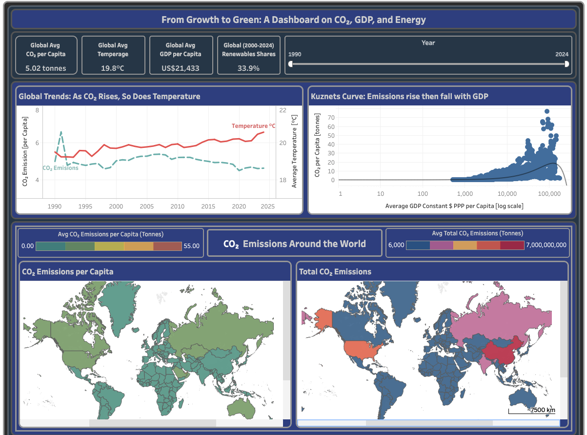
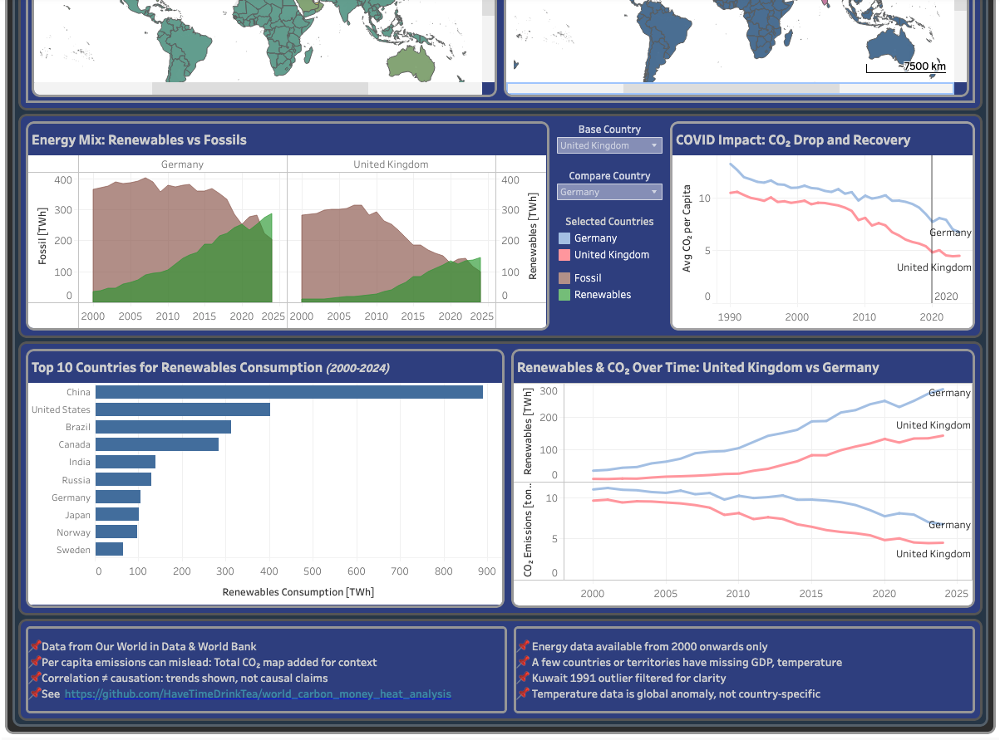

# 🏭 🌱 The Great Decoupling: Can Economic Growth Occur Without Increasing Carbon Emissions?

---

## Project Overview

The ```world_carbon_money_heat_analysis``` project investigates whether economic growth can be decoupled from CO2 emissions. Using global, country-level data, the analysis explores how economic development, energy composition, and structural differences influence emissions patterns over time.

The project integrates datasets on CO2 emissions per capita, GDP per capita, population, and energy production sources into a unified analytical dataset. Statistical techniques and visualisations are applied to identify relationships, trends, and disparities across countries and income groups.

By combining multiple data sources and analytical approaches, the project provides a comprehensive examination of how economic activity and energy use contribute to environmental impact, supporting the broader goal of sustainable development (IPCC, 2021).

The project team has the following contributors:
* Naqash [github.com/naqashb7](https://github.com/naqashb7)
* Pei [github.com/havetimedrinktea](https://github.com/havetimedrinktea)
* Shazia [github.com/szm2701](https://github.com/szm2701)

--- 

## Project Links
* [Github repo](https://github.com/HaveTimeDrinkTea/world_carbon_money_heat_analysis)
* Interactive Tableau Dashboard on [Tableau Public](https://public.tableau.com/app/profile/pei.wang1891/viz/dashboard_world_carbon_money_heat/MainDashboard2?publish=yes) or via [download the dashboard_world_carbon_money_heat.twbx](dashboard/dashboard_world_carbon_money_heat.twbx)
* [Kanban Board on GitHub](https://github.com/users/HaveTimeDrinkTea/projects/4/views/1)

--- 

## Project Narrative

This project explores whether economic growth can be achieved without increasing carbon emissions, a concept known as “decoupling.” Historically, economic development has been closely linked with environmental degradation, as industrialisation and increased energy demand have driven higher levels of carbon emissions (Stern, 2010).

However, advancements in renewable energy, global climate policies, and technological innovation have raised the possibility that countries can grow economically while reducing their environmental impact (OECD, 2020; International Energy Agency, 2022). This transition is critical in the context of climate change, where reducing emissions is essential for long-term sustainability (IPCC, 2021).

Using global datasets from Our World in Data (Ritchie et al., 2020), including CO2 emissions per capita, energy production by source, population, and GDP per capita, this project investigates trends across countries and over time.

The analysis examines key factors influencing emissions, including renewable energy adoption, income levels, and global disruptions such as the decline in emissions observed in 2020. By comparing countries across income groups, the project identifies structural differences in emission patterns and evaluates whether cleaner energy transitions are sufficient to offset the environmental impact of economic growth.

---

## Project Motivation

Climate change is one of the most significant global challenges, driven largely by rising greenhouse gas emissions (IPCC, 2021). Historically, economic growth has been associated with increased emissions due to industrialisation and fossil fuel dependence (Grossman & Krueger, 1995).

At the same time, economic development remains essential for improving living standards and reducing poverty (World Bank, 2024). This creates a fundamental tension between development and environmental sustainability.

This project is motivated by the need to evaluate whether economic growth can occur without increasing emissions and to identify the key factors influencing global emission trends.

---

## Business Case

Understanding the relationship between economic growth and CO2 emissions has significant implications for policymakers, organisations, and investors.

Governments require robust, evidence-based insights to design climate strategies that balance economic development with emissions reduction targets (OECD, 2020). Similarly, organisations and investors rely on environmental data to inform ESG (Environmental, Social, Governance) decision-making and long-term sustainability planning.

This project provides actionable insights into whether economic growth remains associated with increased emissions and whether renewable energy adoption contributes to emissions reduction. These findings support more informed decision-making in areas such as energy policy, sustainability strategy, and climate risk management.

---

## Target Audience

This project is designed for both technical and non-technical audiences.

Technical audiences include data analysts, researchers, and data science professionals who require detailed explanations of statistical methods, modelling approaches, and data processing techniques.

Non-technical audiences include policymakers, sustainability professionals, business stakeholders, and the general public, who require clear, accessible insights supported by visualisations and concise explanations.

---

## Project Objectives

The primary objective of this project is to assess whether economic growth can be decoupled from CO2 emissions.

To achieve this, the project aims to:

- Analyse the relationship between GDP per capita and CO2 emissions
- Evaluate whether renewable energy adoption is associated with reduced emissions
- Assess changes in emissions over time, particularly between 2019 and 2020
- Compare emissions across income groups
- Provide clear, data-driven insights into sustainability and economic development

---

## Project Approach & Project Plan

| Phase | Tasks |
|:---|:---|
| Days 1 | Hypothesis formation, data sourcing  |
| Day 2 - 3 | ETL and EDA, Hypothesis testings, Predictive modelling, Tableau Dashboard |
| Day 4 | Bug fixes, Readme documentation and final submission |


## Data Sources and ETL Summary

### Data Sources
📌 The project uses data from:
* CO<sub>2</sub> emissions per capita, Population ajnd Energy sources data from[Our World In Data](https://ourworldindata.org)
* WorldBank Economic data via the [wgapi package](https://pypi.org/project/wbgapi/)
* WorldBank Climate data via their [Climate Change Knowledge Portal](https://climateknowledgeportal.worldbank.org/download-data)

| Source | Dataset | Period | Variables |
|:---|:---|:---|:---|
| | CO₂ emissions | 1900-2024 | co2_pc | 
| | Population | 1900-2024 | population | 
| | Energy | 2000-2024 | numerous variables for renewables, fossil fuels |
| World Bank | Climate | 1990-2023 | temperature anomaly |
| World Bank | GDP | 1990-2023 | gdp_per_capita (PPP) |


### ETL
| | Main Steps | Description | 
|:---|:---|:---|
| Juypter Notebooks| Filtering | Limited analysis to 1990-2023 for data consistency |
| | Standardisation | Convert all country code to ISO 3 naming convention |
| | Pivoting | unpivot the wide data to long data for GDP data |
| | Extraction from JSON | temperature data | 
| | Merging | Joined datasets by country_code_iso3 and year |
| Tableau | Outlier Handling | Excluded Kuwait 1991 (CO₂ = 364 tonnes) to prevent scale distortion |
| | Calculated Fields | Created renewables_consumption, fossil_consumption, total_co2 |
| | Parameter Controls| Added Base Country and Compare Country for dynamic comparisons |

---

### Key Assumptions
* Depending on the availablity of data, this projects looks at the following periods for
* CO2, Population, GDP and temperature data: 1990 - 2024
* Energy sources: 2000-2024 

## Research Questions

- Is economic growth still associated with higher CO2 emissions per capita, or is decoupling occurring?
- Does a higher share of renewable energy lead to lower emissions?
- Did CO2 emissions decrease between 2019 and 2020?
- Do higher-income countries emit more CO2 per capita than lower-income countries?

---

## Hypotheses

- H1: GDP per capita is positively associated with CO2 emissions per capita
- H2: Renewable energy is negatively associated with CO2 emissions per capita
- H3: CO2 emissions per capita decreased between 2019 and 2020
- H4: CO2 emissions per capita differ across income groups

Each hypothesis is tested against a corresponding null hypothesis using appropriate statistical methods.

---

## Hypothesis Testing

Each hypothesis is evaluated using statistical methods appropriate to the data and research questions:
- Linear Regression → GDP vs CO2 emissions (H1)
- Multiple Regression → Renewable energy and GDP vs CO2 emissions (H2)
- Paired t-test → Emissions comparison between 2019 and 2020 (H3)
- One-way ANOVA → Emissions across income groups (H4)

These methods are widely used in empirical economic and environmental research to identify statistically significant relationships within observational data (Wooldridge, 2013).

---

## Key Findings

- Economic growth is significantly associated with higher CO2 emissions.
- Renewable energy does not show a statistically significant independent effect when controlling for GDP.
- CO2 emissions decreased significantly between 2019 and 2020. 
- Higher-income countries have substantially higher emissions than lower-income countries.

Overall, the findings suggest limited evidence of decoupling between economic growth and CO2 emissions.

---

## Interactive Dashboard
* An interactive dashboard is created to explore the relationships between economic development, energy sources, and CO₂ emissions across countries from 1990 to 2024.

### Dashboard layout:

| Section | Content |
|:---|:---|
| Top Bar | KPI cards: CO₂ per capita, Temperature Anomaly, GDP per capita, Renewables Share + Global Year Slider |
| Row 1 | Global Trends: CO₂ vs Temperature + Kuznets Curve (GDP vs CO₂) |
| Row 2 | World Map CO₂ per capita + World Map  Total CO₂ Map |
| Row 3 | Energy Mix (country comparison) + COVID Impact (country comparison) with 2 countries comparision controls 7 Legends|
| Row 4 | Top 10 Renewables Countries + Renewables vs CO₂ (scatter plot) |
| Bottom Section | Ethics and Limitations |

### Interactive Features:
| Feature | How to Use |
|:---|:---|
| Year Slider | Select year range — updates all charts except for 2-countries comparison charts|
| Base Country / Compare Country | Select two countries to compare in Energy Mix and COVID Impact charts |
| World Map | Hover for country data; year slider animates through time |
| Kuznets Curve | Click any dot to filter other charts to that country |
| All charts | Hover to see country details |




---

## Ethical Considerations
* Data sourced from Our World in Data and World Bank are publicly available
* Per capita emissions
  * Added Total CO₂ map for context
* Correlation ≠ causation:
  * trends shown, not causal claims
* For consistency analysis limited to 
  * 1990 to 2024 for CO<sub>2</sub>, population, GDP per capital (2021 constant US$, PPP) and annual average temperatures.
  * 2000 to 2024 for energy sources.

---

## Limitations
* Energy sources data is from 2000 to 2024 only.
  * Long-term renewable trends cannot be analyzed before 2000
* Missing country-years	
  * Some countries have incomplete data for certain years (especially back to 1990)
* Temperature data is anomaly
  * Data shows warming relative to baseline, not absolute temperature
* GDP per capital (2021 constant US$, PPP) measures output. It does not measure  well-being.
  * Economic growth does not capture environmental or social health
* No causal modeling
  * Charts show correlations, not drivers or causation
* Global averages mask regional variation	
  * Some countries may deviate from global patterns

---

## Tech Stack & Libraries
* Libraries used in the project
* 
* Libraries:
  * [](#)
  * [](#)
  *  
  * 
  * 
  * [](https://pingouin-stats.org/)
  * 
* 
* 

---

## How to Reproduce This Project
* (Recommended) Create a virtual environment.
* Clone the repository
> git clone https://github.com/HaveTimeDrinkTea/world_carbon_money_heat_analysis.git
* Install dependencies: 
> pip install -r requirements.txt
* Open the Jupyter notebooks (e.g.):
> jupyter notebook jupyter_notebooks/01a_etl_owid_co2_data.ipynb

-- 

## License
MIT License [](https://opensource.org/licenses/MIT)

--

## Credits and Acknowledgements
* Our tutors Mr Vasi Pavaloi and [Mr. Mark Briscoe](https://github.com/mbriscoe/)
* eLearning materials of the "Data Analytics with AI" Bootcamp by the Code Institute
* [Code Institute's Github sample repo](https://github.com/Code-Institute-Org/data-analytics-template)
* Python and the relevant packages' official Websites
* Visualisation guidance:
  * [From Data to Viz](https://www.data-to-viz.com)
  * [The Royal Statistical Society's Best Practices for Data Visualisation](https://royal-statistical-society.github.io/datavisguide/docs/choosing.html)

 

## Contributions
* If you have any query or contribution about this repo, please contact 
  * Naqash [github.com/naqashb7](https://github.com/naqashb7),
  * Pei [github.com/havetimedrinktea](https://github.com/havetimedrinktea) or
  * Shazia [github.com/szm2701](https://github.com/szm2701)


## References

- Grossman, G. M., & Krueger, A. B. (1995). *Economic growth and the environment*. The Quarterly Journal of Economics, 110(2), 353–377. https://doi.org/10.2307/2118443

- International Energy Agency. (2022). *World energy outlook 2022*. https://www.iea.org/reports/world-energy-outlook-2022

- Intergovernmental Panel on Climate Change (IPCC). (2021). *Climate change 2021: The physical science basis*.

- Organisation for Economic Co-operation and Development (OECD). (2020). *Environment at a glance 2020*. OECD Publishing. https://doi.org/10.1787/4ea7d35f-en

- Ritchie, H., Roser, M., & Rosado, P. (2024). *CO₂ and greenhouse gas emissions*. Our World in Data. https://ourworldindata.org/co2-and-greenhouse-gas-emissions

- Stern, N. (2010). *The economics of climate change*. In *Climate ethics: Essential readings* (pp. 39–76).

- Wooldridge, J. M. (2013). *Introductory econometrics: A modern approach* (5th ed.). South-Western Cengage Learning.

- World Bank. (2024). *World development indicators*. https://data.worldbank.org


